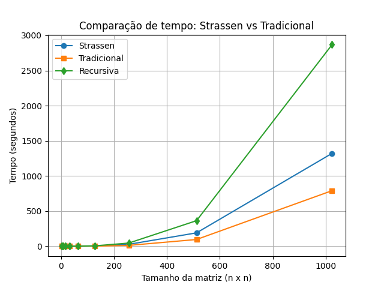
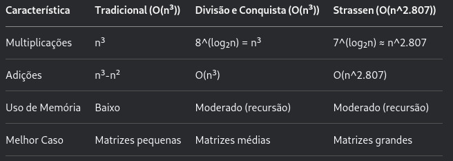

# Engenharia de Programas - Multiplicação de matrizes

> Discentes: Alysson dos Anjos, Cainan de Brito, Letícia Almeida e Victor Hugo Bittencourt

## Entrega 1: Divisão e Conquista
- Método trivial x Divisão e Conquista Básica x Algoritmo de Strassen

    >3 laços aninhados x recursiva com 8 multiplicações x recursiva com 7 multiplicações

    >complexidade: O(n³) x O(n³) x O(n2.81) 

- O foco está em avaliar o desempenho desses algoritmos tanto em relação ao tempo de execução quanto à sua eficiência estrutural (uso de operações e profundidade de chamadas recursivas), considerando diferentes tamanhos de matrizes quadradas.
- Foram usadas as bibliotecas numpy, time, matplotlib e table
- Testes feitos no Linux, no ambiente do VScode
- Os experimentos consistiram em multiplicar pares de matrizes quadradas de ordem crescente (n=2,4,8,16,....1024) e registrar o tempo de execução de cada algoritmo.
- resultado:
  
  

## Entrega 2: Programção Dinâmica

## ENtrega 3: Algoritmo Greedy
